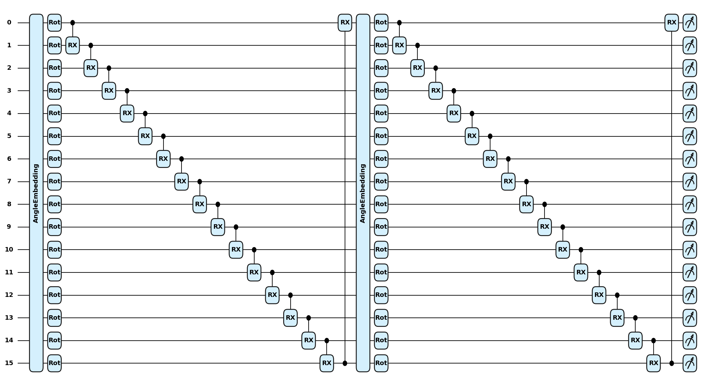
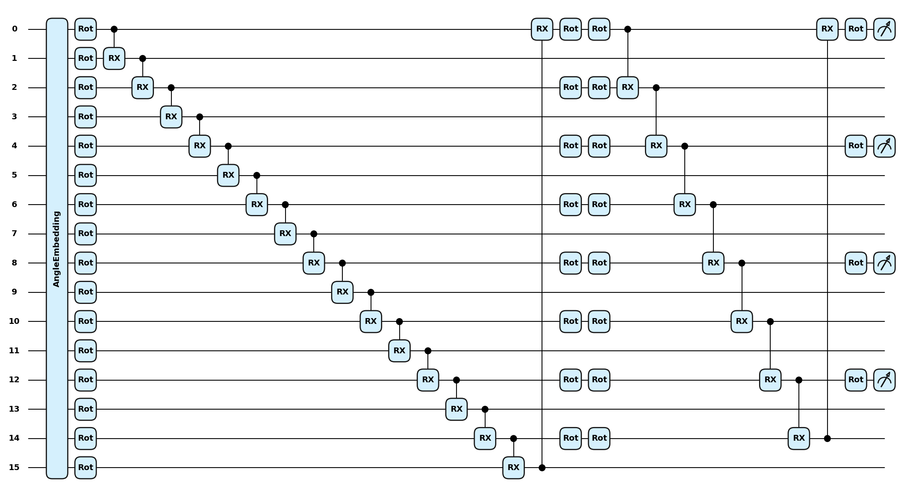

# Towards Quantum Machine Learning for Malicious Code Analysis

In this research, we developed and evaluated Quantum Machine Learning (QML) models for malware classification tasks. The models developed include the Quantum Multilayer Perceptron (QMLP) and the Quantum Convolutional Neural Network (QCNN), developed using the PennyLane and PyTorch frameworks.

## Datasets

For this research the datasets used were:

- API Graph
- AZ-Class-Task
- AZ-Domain
- Ember-Class-Task
- Ember Domain
  
Each dataset was preprocessed and transformed for compatibility with hybrid classical-quantum architectures.

## Models
### Quantum MLP circuit

### Quantum CNN circuit


## Reproducibility

### System requirements:

The following system requirements are necessary for the code to run:

- CUDA Version: 12.8
- Python: 3.10.18
- PennyLane: 0.41.1
- PyTorch: 2.7.1
- RAM: ≥16gb **recommended**

### Enviroment setup
To set up the conda enviroment used, run the following lines of code:
```
conda create -f qmlenv.yml
conda activate qmlenv
```

### Running the code
Training scripts are available in the `Models` folder. To train a model and evaluate performance metrics:

1. Activate the conda environment.
2. Navigate to the desired model script.
3. Run the script to begin training. Performance metrics (e.g., accuracy, precision, recall, F1-score, ROC-AUC) will be automatically computed and saved upon completion.

### Pretrained models
Pretrained models for each dataset and architecture are available in the `saved_models/` directory. These can be used for evaluation without retraining.
